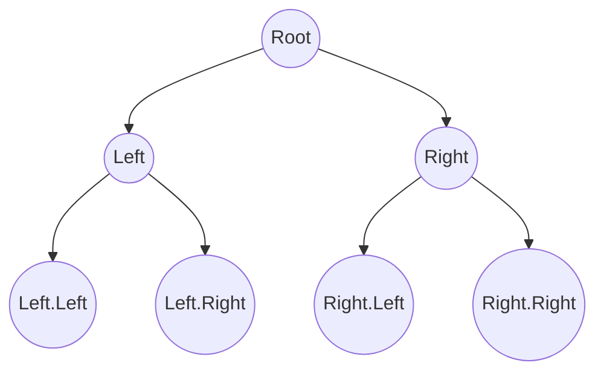

---
categories:
  - "[[Algorithm]]"
---

1. Works on a sorted array. 
2. [[Inorder Traversal]]
3. Its invariant is that at each step, the target (if it exists) must be within the current `[low, high]` range.	
4. Each comparison removes half of the remaining search space, giving the algorithm a time complexity of **O(log⁡(n))**.
5. BST operations (search, insert, delete) normally aim for:
6. Height ≈ log₂(n) → **O(log n)** operations.

