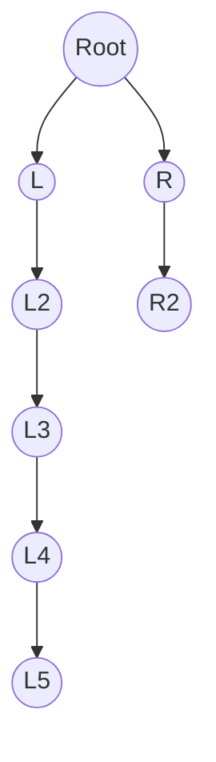

- Characteristics are similar to Binary Search Tree, but
-  One side is bigger than the other
	-  Example: Link list

1. Why Does an Unbalanced BST Become **O(n)**?
	- If the tree becomes **unbalanced**, the height can degrade to:
	- **Worst case height:** n (all values inserted in sorted order, or pathological insertion patterns)
	- Search cost = walk down the entire chain
	- Insert cost = search cost first
	- Delete cost = search + restructure
	&rarr; **O(n)** time, because you may have to traverse every node to reach the bottom.